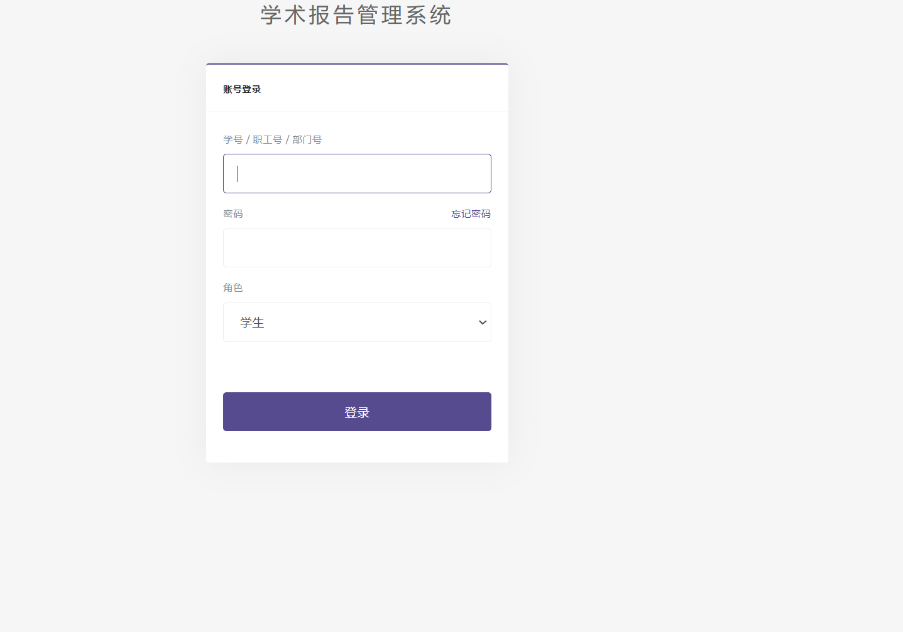
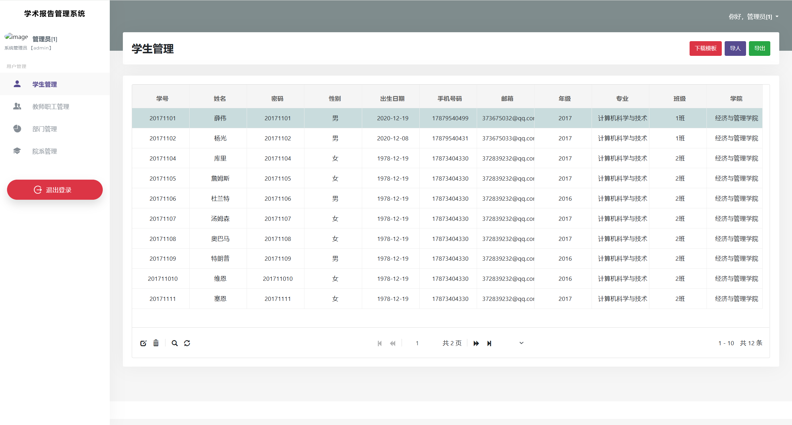
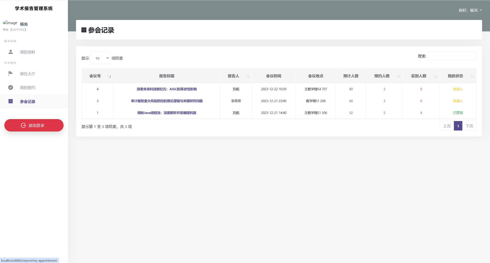
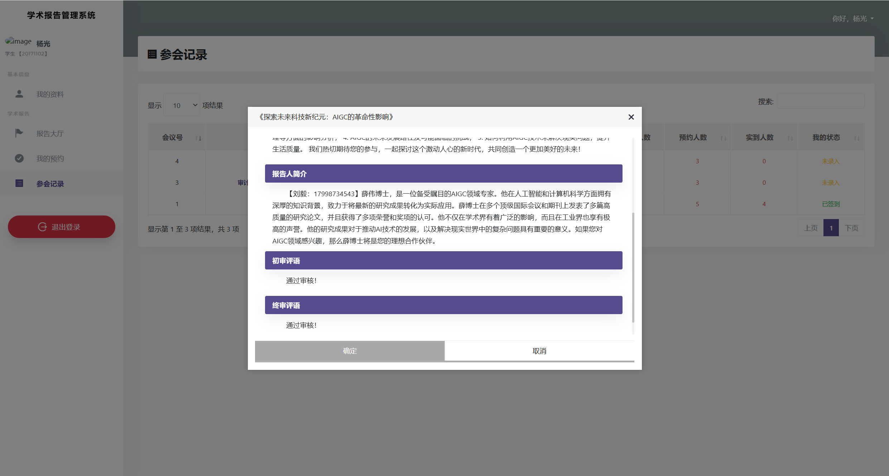

## 项目介绍

智慧高校学术报告系统（academic-report）是一个基于 SpringBoot 开发的标准 Java Web 项目。**系统整体页面设计简约大气，巧妙融合了目前备受瞩目的 AIGC 生成式 AI 技术，选择了阿里通用千问大语言模型，以智能生成趣味报告标题和润色报告内容等方式，提升系统的整体品味。**系统涵盖了丰富的 Excel 表格操作功能，支持信息的高效导入和导出。整个系统设计完善，内置了复杂的审核流程，旨在为高校提供一套信息化管理的优质解决方案。该系统不仅易于初学者理解和学习，而且在学校项目答辩和毕业设计等场景中表现出色。

## 项目截图

## 价格（良心价）

1. **199单项目**
2. **249包安装**

### 角色功能介绍

四种系统角色：教师、部门、学生、管理员。

系统共设计了六类业务角色：系统管理员、教师、学院院长、教务部门、宣传部门、学生。

接下来我们以业务角色的视角来看一下各个角色的功能权限。

#### 系统管理员功能介绍

| 功能模块         | 功能描述                                    |
| ---------------- | ------------------------------------------- |
| 登录方面         | 登录系统                                    |
| 账号方面         | 修改登录密码                                |
| 学生信息维护     | 多条件查询、编辑、删除、Excel批量导入、导出 |
| 教师职工信息维护 | 多条件查询、编辑、删除、Excel批量导入、导出 |
| 学校部门管理     | 多条件查询、编辑、删除                      |
| 学院管理         | 多条件查询、编辑、删除                      |

#### 教师功能介绍

| 功能模块     | 功能描述                                                     |
| ------------ | ------------------------------------------------------------ |
| 登录方面     | 登录系统                                                     |
| 账号方面     | 查看、修改个人资料、修改登录密码等                           |
| 学术报告方面 | 发布学术报告（填写标题、简介、报告人简介，支持 AIGC 代写润色、上传附件）、编辑、查询审核状态、导出报告文件及附件、回收站等 |
| 报告会议方面 | 查看会议安排以及报名情况、导出报告文件及附件                 |
| 历史会议方面 | 系统根据报告时间自动更新会议状态，教师可查看历史会议信息、学生签到统计情况、修改学生签到状态、导出签到表等 |
| 消息中心     | 查看系统消息、清空消息列表等                                 |

#### 学院院长功能介绍

学院院长本质上属于特殊的“教师”。

| 登录方面     | 登录系统                                                     |
| ------------ | ------------------------------------------------------------ |
| 功能模块     | 功能描述                                                     |
| 账号方面     | 查看、修改个人资料、修改登录密码等                           |
| 学术报告方面 | 发布学术报告（填写标题、简介、报告人简介，支持 AIGC 代写润色、上传附件）、编辑、查询审核状态、导出报告文件及附件、回收站等 |
| 报告会议方面 | 查看会议安排以及报名情况、导出报告文件及附件                 |
| 历史会议方面 | 系统根据报告时间自动更新会议状态，教师可查看历史会议信息、学生签到统计情况、修改学生签到状态、导出签到表等 |
| 消息中心     | 查看系统消息、清空消息列表等                                 |
| 报告审核     | 查看本院教师提交的学术报告列表、查看报告详情、下载报告材料以及附件、审核报告并填写意见（通过/驳回） |

#### 教务部门功能介绍

教务部门本质上属于部门的系统角色。

| 登录方面     | 登录系统                                                     |
| ------------ | ------------------------------------------------------------ |
| 功能模块     | 功能描述                                                     |
| 账号方面     | 查看部门资料、修改登录密码等                                 |
| 报告审核     | 查看本院教师提交的学术报告列表、查看报告详情、下载报告材料以及附件、审核报告并填写意见（通过/驳回） |
| 已通过审核   | 查询已经通过的所有学术报告列表、详情、状态等                 |
| 报告会议统计 | 按照学年、学期查询报告会议、查看具体的签到统计情况、导入签到表、导出签到表、修改学生的签到状态等 |

#### 宣传部门功能介绍

宣传部门本质上属于部门的系统角色。

| 登录方面 | 登录系统                                                     |
| -------- | ------------------------------------------------------------ |
| 功能模块 | 功能描述                                                     |
| 账号方面 | 查看部门资料、修改登录密码等                                 |
| 会议排期 | 查看本院教师提交的学术报告列表、查看报告详情、下载报告材料以及附件、安排学术报告会议（时间地点人数等，安排会议后开放预约，学生可登录系统进行预约报名） |
| 预约情况 | 查看本院教师的学术报告会议的预约情况，修改会议安排等         |
| 准备会议 | 查看本院报告会议（已截止报名预约且未开始会议），统计报名情况，便于准备工作。 |
| 会议统计 | 查看历史会议信息、学生签到统计情况、修改学生签到状态、导出签到表等 |

#### 学生功能介绍

| 功能模块 | 功能描述                                                     |
| -------- | ------------------------------------------------------------ |
| 登录方面 | 登录系统                                                     |
| 账号方面 | 查看、修改个人资料、修改登录密码等                           |
| 报告大厅 | 查看当前可报名预约的所有报告会议（简介、报告人、会议信息、报名情况、报告材料等），报名预约 |
| 我的预约 | 查看当前已经预约的所有报告会议、查看报告详情等               |
| 参会记录 | 查看自己报名参加的，已完成的学术报告会议，查看自己的签到状态（需进行线下签到并由教务部门导入签到表到系统） |

## 技术介绍

### 前端

| 名称               | 描述                                                         |
| :----------------- | ------------------------------------------------------------ |
| HTML、CSS          | 用于设计网页的内容和样式                                     |
| JavaScript、JQuery | 作为开发 Web 页面的脚本语言，为网页添加各式各样的动态功能，为用户提供更流畅美观的浏览效果 |
| Bootstrap          | 基于 HTML、CSS、JavaScript 开发的简洁、直观、强悍的前端开发框架，使得 Web 开发更加快捷 |
| 前端模板           | 智慧医药系统页面模板，模板文件已放在分享项目目录下           |

### 后端

| 名称       | 描述                                                         |
| ---------- | ------------------------------------------------------------ |
| SpringBoot | SpringBoot 是由 Pivotal 团队提供的全新框架，其设计目的是用来简化新 Spring 应用的初始搭建以及开发过程。该框架使用了特定的方式来进行配置，从而使开发人员不再需要定义样板化的配置。通过这种方式，SpringBoot 致力于在蓬勃发展的快速应用开发领域成为领导者。 |
| SpringMVC  | Spring MVC 属于 SpringFrameWork 的后续产品，已经融合在 Spring Web Flow 里面。Spring 框架提供了构建 Web 应用程序的全功能 MVC 模块。 |
| MyBatis    | MyBatis 是一个 Java 持久化框架，它可以帮助开发者更轻松地管理数据库访问和SQL映射。它提供了一种简单且灵活的方式来进行数据库操作，同时还支持动态 SQL、缓存和批量操作等功能。 |
| Thymeleaf  | Thymeleaf 是一个流行的模板引擎，该模板引擎采用 Java 语言开发的，用于渲染 XML/XHTML/HTML5 内容的模板引擎。类似 JSP、Velocity、FreeMaker 等，它也可以轻易的与 Spring MVC 等 Web 框架进行集成作为 Web 应用的模板引擎。 |
| Druid      | Druid 是一个高效的数据查询系统，主要解决的是对于大量的基于时序的数据进行聚合查询。数据可以实时摄入，进入到 Druid 后立即可查，同时数据是几乎是不可变。通常是基于时序的事实事件，事实发生后进入 Druid，外部系统就可以对该事实进行查询。 |
| EasyPoi    | 一款基于 Java 的开源框架，专注于简化 Excel 文件的操作和处理。该框架提供了易于使用的 API，使开发人员能够轻松地在 Java 应用程序中进行 Excel 文件的读取、写入、导入和导出操作。EasyPoi 的设计目标是让处理 Excel 文件变得简单、高效，并提供了灵活的注解配置，使开发者能够更便捷地实现对 Excel 数据的操作。通过 EasyPoi，开发人员可以快速地实现 Excel 数据与 Java 对象之间的转换，从而方便地进行数据导入、导出等操作。 |

### 开发工具与环境

- **阿里云 OSS 对象存储**

  阿里云对象存储 OSS（Object Storage Service）是一款海量、安全、低成本、高可靠的云存储服务，对于我们这个项目而言，所有的二进制文件，包括头像、用户上传的文件都是存储到了 OSS 里面（调用相关的工具类），在数据库中只是保存了文件的 URL 地址。通过这个 URL 地址就可以获取、下载指定文件

- **阿里云 AIGC 通义千问大语言模型**

  通义千问，是阿里云推出的一个超大规模的语言模型，功能包括多轮对话、文案创作、逻辑推理、多模态理解、多语言支持。能够跟人类进行多轮的交互，也融入了多模态的知识理解，且有文案创作能力，能够续写小说，编写邮件等。

